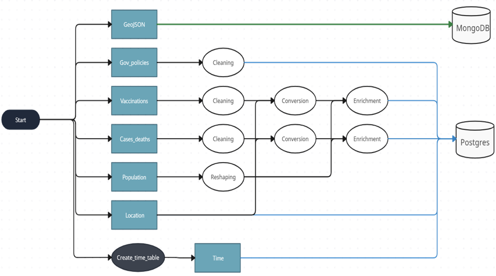

# COVID 23

## Introduction

We wanted to explore and analyse in a quantitative way the covid 19 period, started towards the end of 2019 and currently ongoing, although under control.

Looking back on those difficult years, we were curious to see how covid was progressing, in terms of cases and deaths, in different countries around the world and over time. 
We also wanted to try to understand the impact that vaccinations and various restrictive measures had on the spread of the disease.
To do this, we collected data from a variety of sources with the aim of integrating them and calculating statistical aggregates useful for a clear and enriched visualisation of how covid has spread around the world. 

Thus, we formulated the following questions:

- How did COVID-19 spread globally, and which countries were most severely affected in terms of the number of cases and deaths?

- Is there a discernible correlation between the COVID-19 situation, vaccination efforts, and the broader political response to the pandemic in various countries?

## Data Sources

The ingestion phase is pretty simple and linear, but there are many files and this might be confusing.

We'll devide our files between tha main ones and the support ones, i.e. files whose purpose is to enrich the others.

Our main files are the followings:

- **Cases & Deaths**: This file is taken from the *_World Health Organization_*. It's a CSV containing the daily cases and deaths for each country in the world. To this day, it's updated daily. 

- **Government measures**: This file is part of the *_Oxford Covid-19 Government Response Tracker_*. It's a CSV containing daily metrics about the policy response to COVID-19 of each country in the world. it covers fully the years 2021, 2022 and 2023. The file contains more than 50 indexes, but for the purpose of this project only 4 will be used. 

- **Vaccinations**: This file comes from the google COVID-19 dataset. It's a CSV containing the daily metrics about the vaccinations process in every region of the world. Here the granularity is finer than a country-granularity, sometimes it becomes even provincial. The updates stopped on October 24, 2022.

The support files are the followings:

- **Locations**: This file is taken from a GitHub repository, it's a JSON containing for each country both the iso-codes (alpha-2 and alpha-3), the region, the sub-region of the country and their respective codes. It is used for both conversion purposes (iso-code is better for merging tables rather then country's name) and as a dimension for the final STAR schema.

- **Population**: These data are taken thorugh the *_World Bank_* API. They contains the yearly population for each country in the world.
We need this data to compute population's dependents statistics.

- **Time Table**: This is a table created in python, it'll be used as the time dimension in the STAR schema

## Data Ingestion

The pipeline for this first phase is represented by the graph below. 

The files are retrieved from the internet thorugh the requests and io libraries and temporarly stored in buffer variables. 
Then, they are all stored in Mongo.  No additional operations are needed in this phase.

## Staging

Here comes the trickier part. The dag below gives a general idea on how this section works. Coming back to the division of the files in "main" and "support", we'll focus on the wrangling applied to the main files.

### Cleaning

For the **Cases & Deaths**, we select the rows containing negative values for the new_daily_cases and new_daily_deaths and we convert them into nan values. This also sets the 7-day rolling average to NA for the next 7 days.
The date is converted to date type and a validity check is performed to make sure that the cumulative cases and deaths are monotonically increasing.

Similar steps are performed for the **Vaccinations** file. Here, we also discard non-relevant columns, such as those that contains vaccinations type specific informations (i.e. metrics dedicated to each type of commercial vaccine: Pfizer, Moderna, johnson & johnson etc...).

For the **Government Measures** file, we only keep the 4 metrics we're interested in: StringencyIndex_Average, GovernmentResponseIndex_Average, ContainmentHealthIndex_Average and EconomicSupportIndex

Additionally, we add the *_Country_Code_* field to each table, to allow merging without losses due to Country names mismatch 

### Enrichment

Now it's time to finally enrich the **Cases & Deaths** and **Vaccinations** tables with some useful statistics. 

First, we compute a rolling average within windows of one and two weeks. This is helpful both to have a more comprehensive view on the evloution of the disease and to have data robust to fluctuations due to reporting errors.  

Moreover, we compute, for each week and bi-week, the growth (or decrease) percentage with respect to the previous 1-2 weeks. This is made to obtain better metrics to define spreading trends.  

In order to give our data meaning, we add to each row the population of that country, in that year (thus performing a merge on date and country fields).
Once we have the value of the population we compute per-capita statistics, such as cases, deaths, vaccinations and their derivative metrics per milion people.

### Storing

After all these steps, our tables are ready to be stored in a data warehouse.
Given the relational and structured nature of our data, the most of obvious choice for the data model was the STAR schema. 
A graph-based databases, in our case, didn't make much sense. Our entities are clear and well defined, the attributes are fixed and shared among all instances within each table.
Not only we do not have data that establish relationships between entities, but also we do not have well defined entities. 
The flexibility of a graph database here doesn't express its potential.
For all this reasons, we chose Postgres to store our data. 
The fact table is represented by the main **Cases & deaths** table, being the one more used for the analysis. The **Vaccinations** and the **Government Measures** are stored as dimension tables, referring the main one thorugh a composite key made of *_date_* and *_country code_*.
Moreover, the dimension tables Time and Location are created, to easly roll-up the analysis to Continents, Sub-Continents and specify the desired time constraint.

## Production

E mo so caazzi

