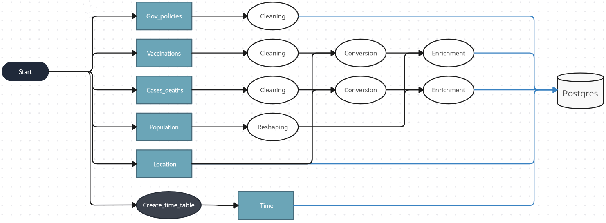

# COVID 23

## Introduction

I wanted to explore and analyse in a quantitative way the covid 19 period, started towards the end of 2019 and currently ongoing, although under control.

Looking back on those difficult years, I were curious to see how covid was progressing, in terms of cases and deaths, in different countries around the world and over time. 
We also wanted to understand how the countries reacted to the pandemic in terms of vaccinations and the impact that the campaign had on the spread of the disease.
To do this, I collected data from a variety of sources with the aim of integrating them and calculating statistical aggregates useful for a clear and enriched visualisation of how covid has spread around the world. 

Thus, the following questions have been formulated:

- How did COVID-19 spread globally, and which countries were most severely affected in terms of the number of cases and deaths?

- How did different countries respond to the pandemic in terms of vaccination efforts, and what impact did this have on the evolution of the pandemic?

## Data Sources

The ingestion phase is pretty simple and linear, but there are many files and this might be confusing.

We'll devide our files between tha main ones and the support ones, i.e. files whose purpose is to enrich the others.

Our main files are the followings:

- **Cases & Deaths**: This file is sourced from the *_World Health Organization_*. It's a CSV containing the daily cases and deaths for each country in the world. As of today, it's updated daily. 

- **Government measures**: This file is part of the *_Oxford Covid-19 Government Response Tracker_*. It's a CSV containing daily metrics about the policy response to COVID-19 of each country in the world. It covers the years 2021, 2022, and 2023 completely. The file contains more than 50 indexes measuring the intensity of the political response in various aspects (School closures, Stay-at-home restrictions etc...).

- **Vaccinations**: This file comes from the google COVID-19 dataset. It's a CSV containing the daily metrics about the vaccinations process in every region of the world. If the Cases & Deaths file contains information at a country level, here we have finer granularity, with regional and sometimes provincial-specific information. The updates stopped on October 24, 2022.

The support files are the followings:

- **Locations**: This file is taken from a GitHub repository, it's a csv containing, for each country, both the iso-codes (alpha-2 and alpha-3), the region, the sub-region of the country and their respective codes. It is used for both conversion purposes (iso-code is better for merging tables rather then country's name) and as a dimension for the final STAR schema.

- **Population**: These data are retrieved through the *_World Bank_* API. They contain the yearly population for each country in the world.
We need this data to compute population's dependents statistics.

- **Time Table**: This is a table created in python, it'll be used as the time dimension in the STAR schema

## Data Ingestion

The pipeline for this first phase is represented by the graph below. 

The files are retrieved from the various sources thorugh the *_requests_* and *_io_* libraries and temporarly stored in buffer variables. Then, they are all stored in Mongo. For the big files **Government measures** and **vaccinations** some preprocessing steps are anticipated before being uploaded to MongoDB. Specifically, for *_Government measures_*, more than 40 columns are discarded as they are not useful for the purpose of the project. For *_Vaccinations_*, around 10 rows containing vaccination-specific information are discarded, and a roll-up is performed to obtain a coarser granularity, matchable with that of *_Cases & Deaths_*. This was done to speed up the uploading process significantly
No additional operations are needed in this phase.

## Staging

Here comes the trickier part. The dag below gives a general idea on how this section works. Coming back to the division of the files in "main" and "support", we'll focus on the wrangling applied to the main files.
Although some cleaning was applied to *_Government measures_* and *_Vaccinations_* before, I'll report it here again for clarity and coherence.

### Cleaning

For **Cases & Deaths**, we select the rows containing negative values for the *new_cases* and *new_deaths* and we convert them into nan values. This also sets the 7-day rolling average to NA for the next 7 days.
The date is converted to date type and a validity check is performed to make sure that the cumulative cases and deaths are monotonically increasing.

Similar steps are performed for the **Vaccinations** file. Here, we also discard non-relevant columns, such as those that contains vaccinations type specific informations (i.e. metrics dedicated to each type of commercial vaccine: Pfizer, Moderna, johnson & johnson etc...).

The data here are less reliable than the previous file; the cumulative data for all countries present many temporal gaps, which we have to address to avoid inconsistencies in visualizations. Moreover, each country presents different time ranges; different countries started the vaccination campaign and ended it (or stopped data collection) at different times. Again, we'll have to cope with this.

For the **Government Measures** file, we only keep the 4 metrics we're interested in: StringencyIndex_Average, GovernmentResponseIndex_Average, ContainmentHealthIndex_Average and EconomicSupportIndex

Additionally, we add the *_Country_Code_* field to each table, to allow merging without losses due to Country names mismatch 

### Structure

To give a better understanding of the various  manipolation, is good to have clearly in mind the structure of *_Cases & Deaths_* and *_Vaccinations_*, after cleaning and coversions.

- **Cases & Deaths**: the main fields are [*Date*, *Country_name*, *Country_code*, *New_cases*, *Cumulative_cases*, *New_deaths*, *Cumulative_deaths*]

- **Vaccinations**: the main fields are [*Date*, *Country_name*, *Country_code*, *New_vaccine_doses_administered*, *Cumulative_vaccine_doses_administered*, *New_persons_vaccinated*, *Cumulative_persons_vaccinated*, *New_persons_fully_vaccinated*, *Cumulative_persons_fully_vaccinated*]

### Enrichment

Now it's time to finally enrich the **Cases & Deaths** and **Vaccinations** tables with some useful statistics. 

The main aggregates for *_Cases & Deaths_* are the following:

- **Weekly_{feature}**: First, we compute a rolling average within windows of one week. This is helpful both to have a more comprehensive view on the evloution of the disease and to have data robust to fluctuations due to reporting errors. This is done only for daily data.

- **Weekly_pct_growth_{feature}**: We compute, for each week, the growth (or decrease) percentage with respect to the previous week. This is made to obtain better metrics to define spreading trends. Again, this is done only for daily data.

- **New/Cumulative_{feature}_per_million**: In order to give our data meaning, we add to each row the population of that country, in that year (thus performing a merge on date and country fields). Once we have the value of the population we compute per-capita statistics, such as cases, deaths, vaccinations and their derivative metrics per milion people.

Here, *_feature_* can be either *_cases_* either *_deaths_*

For *_Vaccinations_*, the same statistics are computed, with some additional expedient:

- **Temporal Allignment**: since every country has its own time range, we perform a right join with an ad-hoc table, containing the cartesian product of all the countries and all the dates in a fixed time period decided a priori (from 2020-12-02 to 2022-09-16). This fill the gaps in the data and allign all the country on the same temporal coordinates. This step may look redundant, but without it the visualizations break.

- **Interpolation**: As mentioned before, the cumulative data present temporal holes. Given the nature of cumulative data (monotonic growth), the holes are reasonably fillable by means of interpolation. Thus we perform it.

Here, *_feature_* can assume the following values: *_vaccine_doses_administered_*, *_persons_vaccinated_*, *_persons_fully_vaccinated_*

### Storing

After all these steps, our tables are ready to be stored in a data warehouse.
Given the relational and structured nature of our data, the most of obvious choice for the data model was the STAR schema. 
A graph-based database, in our case, didn't make much sense. Our entities are clear and well defined, the attributes are fixed and shared among all instances within each table.
The flexibility of a graph database here doesn't express its potential.
For all this reasons, we chose Postgres to store our data. 
The fact table is represented by the main **Cases & deaths** table, being the one more used for the analysis. The **Vaccinations** and the **Government Measures** are stored as dimension tables, referring the main one thorugh a composite key made of *_date_* and *_country code_*.
Moreover, the dimension tables Time and Location are created, to easly change the granularity of the analysis to Continents, Sub-Continents and specify the desired time constraints.

## Production

### Pulling

First, the data are retrieved from the Postgres database through queries that select only the fields and files needed for the visualizations, and they are immediately stored in **dags/files_production**.
Here, the airflow dag stops an the production is carried on locally.

### Stramlit

Finally, we have the data ready to be visualized. Given the types of data, there are many ways and things to visualize. Thus, a Streamlit application is built to give the user the freedom to explore the data in the most appropriate manner.

The code that builds the application is contained in **dags/Streamlit_app.py** and it should be launched by running locally the **dags/Production_notbook.ipynb**.

To answer the first question (i.e. How did COVID-19 spread globally, and which countries were most severely affected in terms of the number of cases and deaths?), two types of animated plots are used.

- **Animated Plot Map** of cases or deaths statistics, showing the evolution of the metrics over time and over the world. The user get to choose which metrics to visualize

- **Animated Line Plot** of cases or deaths statitics, showing the evoultion of the metrics for few countries (max 5). The user get to choose the countries and the metrics to explore. 

These visualizations clearly show the evolution of the pandemic over time. The statistics related to confirmed cases are a good indicator of the COVID-19 waves, whereas the deaths indicate better if the management of a country was effective or not.

To answer the second question (i.e. How did different countries respond to the pandemic in terms of vaccination efforts, and what impact did this have on the evolution of the pandemic?), two visualizations are exploited.

- **Animated World Map**, similar to the cases and deaths plots. Again, the user get to choose the metrics to visualize. 

- **Three Static Line Plots**, showing the evolution of the *cumulative vaccinations* compared to the evoultion of *New cases* and *New deaths*.

The results clearly show the effects of the vaccinations on the deaths, whereas this is not visable with respect to the *cases*.

### Production_backup.ipynb

This notebook contains pretty much the same analysis as the Streamlit application. It was created for two main reasons:

- **Issues resilience**: if some issues arise with the Streamlit application, the notebook is available as a backup for exploring the analysis.

- **Playing with Data**: if someone wants to explore the analysis and visualizations more deeply, they can manipulate the data using the notebook, which is clearly more usable than the Streamlit application.

## How to Use

- Run the command *_docker compose up_* in the terminal

- Go on *_localhost:8080_*, where you will find the airflow web interface.

- Set the connection **postgres** and **mongo**. The credential for postgres are *username=airflow* and *password=airflow*, for the mongo no username or password have been set, just leave blank spaces.

- Trigger the dag, it will take about 5 minutes to complete.

- Once the dag is finished, the two files **cases_deaths** and **vaccinations** will be in the path **dags/files_production**

- Now, run the only cell contained in **dags/Production_notebook.ipynb** to run the streamlit application

- A web page should automatically open at **localhost:8501**

- Now you can freely explore the data!

### Off-line Testing 

To guarantee the possibility to test the project without running the dag, two wrangled files are available at the paths **Production_exploration/local_files_production/cases_deaths.csv** and **Production_exploration/local_files_production/vaccinations.csv**. To run the production you can launch the application **Production_exploration/Streamlit_app.py** by running the notebook **Production_exploration/Local_streamlit_testing.ipynb**.

For a deeper and local exploration of the project, the **Production_exploration/Local_project_testing.ipynb** is available. It wraps all the steps executed by the dag but locally, by means of the wrangling functions contained in **Production_exploration/Utils.py**. From the ingestion to the visualization, everything can be tested locally there. Just run all the cells, the markdown comments will guide you through the analysis.  

